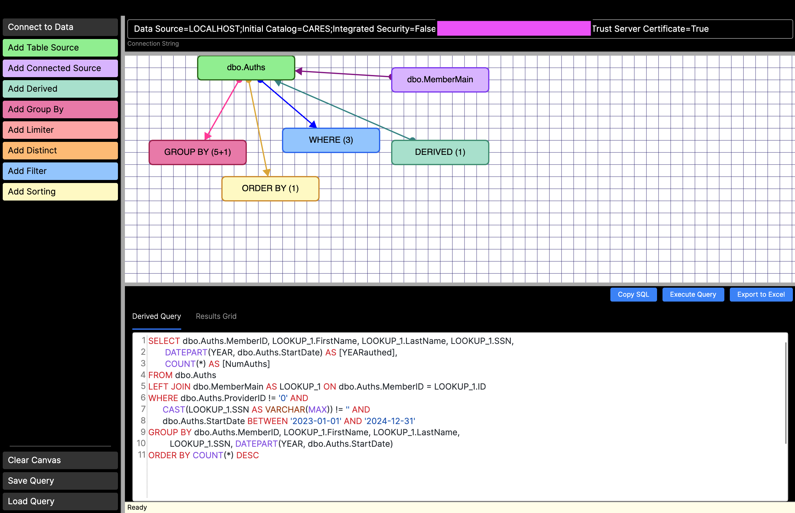
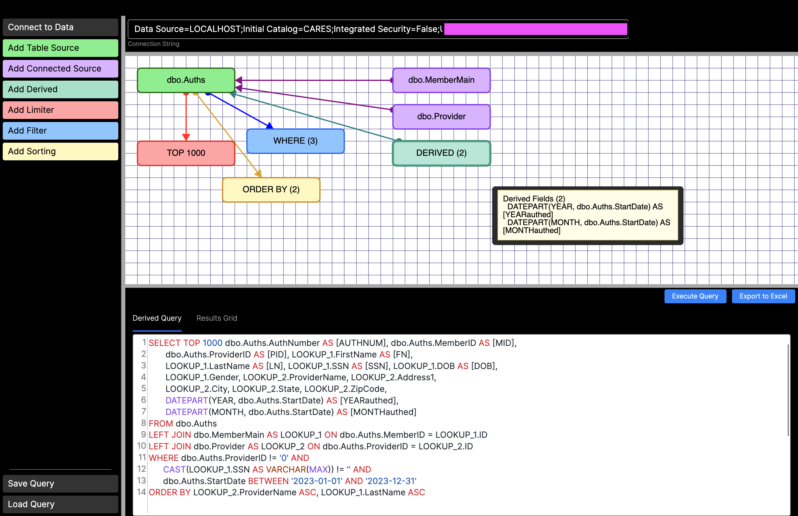
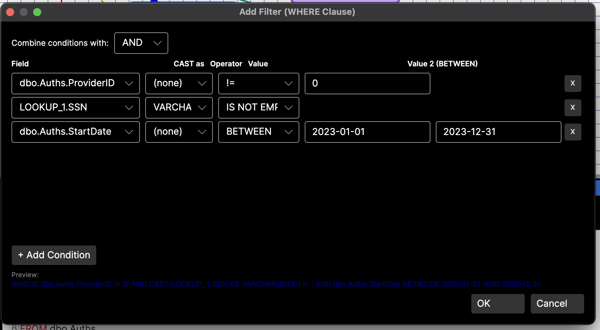
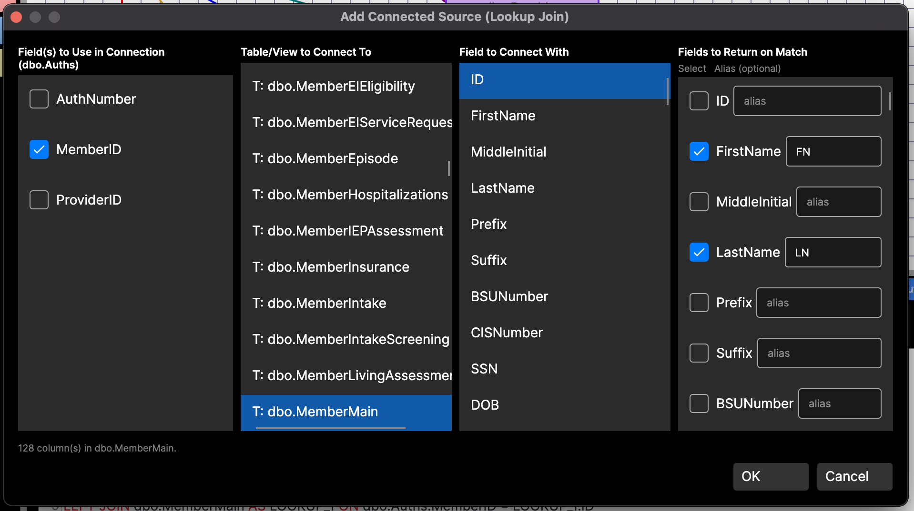
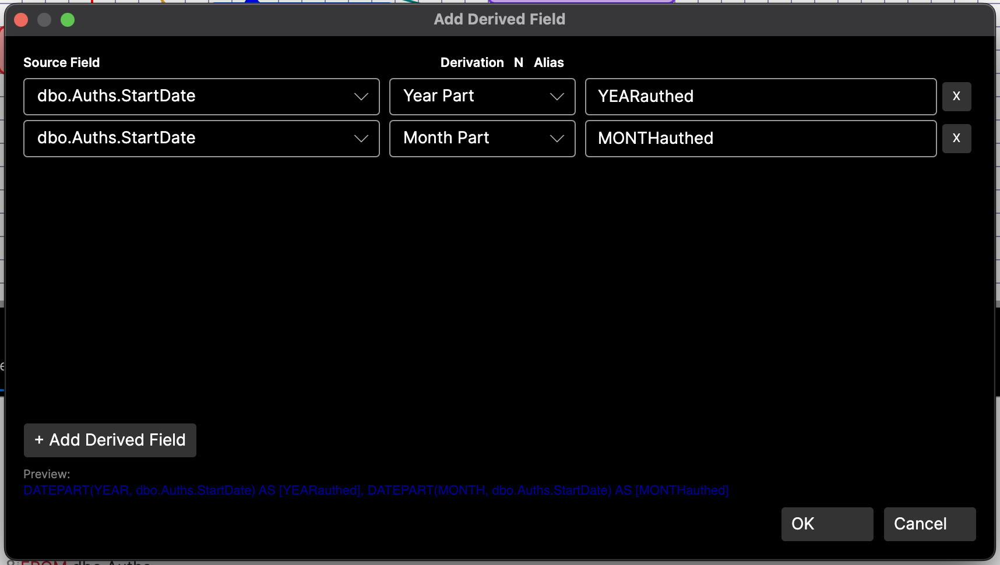
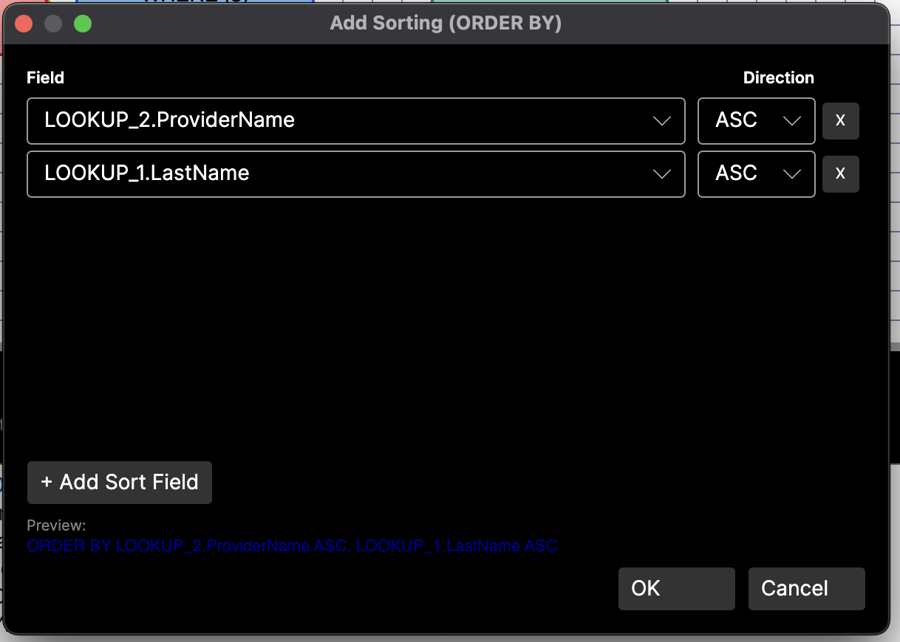

# AVA Query Builder

A visual SQL query builder built with .NET 9 and [Avalonia UI](https://avaloniaui.net/). Construct SELECT queries by dragging and configuring visual entities on a structured diagram canvas, then execute them against Microsoft SQL Server and view results in an integrated data grid.

## Overview

AVA Query Builder provides a graphical approach to building SQL queries. Instead of writing SQL by hand, users add visual entities to a canvas — tables, lookup joins, derived fields, limiters, filters, and sorting — and the application generates the corresponding SQL in real time. The generated query is displayed with syntax highlighting and can be executed directly against the connected database.

## Features

### Database Connection
- **Server Discovery** — Browse for SQL Server instances on the local network via UDP broadcast to the SQL Browser service (port 1434).
- **Authentication** — Supports both Windows Authentication and SQL Server Authentication.
- **Database Selection** — Queries the server for available databases and populates a dropdown for selection.
- **Connection String** — Auto-built from selections, or manually editable for environments with non-standard configurations.
- **Test Connection** — Verify connectivity before committing.

### Visual Query Building

Entities are added to an interactive canvas ([AVASdCanvas](https://github.com/harlock123/AVASdCanvas)) and connected with arrows to show relationships. Each entity type has a distinct color:

| Entity Type | Color | Description |
|---|---|---|
| **Table Source** | Light Green | A base table or view to SELECT from. Choose specific columns with optional aliases. |
| **Connected Source (Lookup)** | Light Purple | A LEFT JOIN to another table. Specify join keys and return fields with optional aliases. Aliased as `LOOKUP_1`, `LOOKUP_2`, etc. |
| **Derived Field** | Light Mint | Computed columns using derivations like UPPER, LOWER, DATEPART, LEN, LEFT, ROUND, and more. Each derived field requires an alias. |
| **Limiter** | Light Red | Adds a `TOP N` clause to the query. Only one limiter at a time. |
| **Filter** | Light Blue | Adds a `WHERE` clause with multiple conditions combined by AND/OR. Supports CAST, BETWEEN, IN, IS NULL, IS EMPTY, and more. |
| **Sorting** | Light Yellow | Adds an `ORDER BY` clause with multiple fields, each ASC or DESC. |

- **Column Aliases** — Both table source and lookup return fields support optional aliases, generating `column AS [Alias]` in the SQL.
- **Double-click** any entity to edit its configuration. Changes are reflected immediately in the generated SQL.
- **Right-click** any entity for a context menu with Edit and Delete options. Deleting the base table removes all entities.
- **Hover** over any entity to see a tooltip with its metadata summary.
- **Connectors** with color-coded arrows show relationships between entities.

### SQL Generation

The query builder scans all canvas entities and generates a SQL SELECT statement:

```sql
SELECT TOP 1000 dbo.Auths.AuthNumber AS [AUTHNUM],
       dbo.Auths.MemberID AS [MID],
       LOOKUP_1.LastName AS [LN], LOOKUP_1.SSN AS [SSN],
       DATEPART(YEAR, dbo.Auths.StartDate) AS [YEARauthed],
       DATEPART(MONTH, dbo.Auths.StartDate) AS [MONTHauthed]
FROM dbo.Auths
LEFT JOIN dbo.MemberMain AS LOOKUP_1 ON dbo.Auths.MemberID = LOOKUP_1.ID
LEFT JOIN dbo.Provider AS LOOKUP_2 ON dbo.Auths.ProviderID = LOOKUP_2.ID
WHERE dbo.Auths.ProviderID != '0'
      AND CAST(LOOKUP_1.SSN AS VARCHAR(MAX)) != ''
      AND dbo.Auths.StartDate BETWEEN '2023-01-01' AND '2023-12-31'
ORDER BY LOOKUP_2.ProviderName ASC, LOOKUP_1.LastName ASC
```

The generated SQL updates live as entities are added, edited, or removed. Long lines are automatically wrapped at ~80 characters on natural boundaries.

### Query Execution

- **Execute Query** button runs the generated SQL against the connected database.
- Results are displayed in an integrated data grid ([LAWgrid](https://github.com/harlock123/LAWgrid)) with the Results Grid tab automatically selected.
- **Export to Excel** button exports the current results grid to an Excel file (`.xlsx`) with full formatting via a save file dialog.

### Syntax Highlighting

The generated SQL is displayed using the [SyntaxColorizer](https://github.com/Harlock123/SyntaxColorizer) control with MS SQL language support, line numbers, and the GitHub Light theme.

### Save / Load

- **Save Query** (`.qry`) — Persists the entire query state to a JSON file: connection string, all canvas entities with positions and metadata, all connectors, and the lookup ordinal counter.
- **Load Query** — Restores a previously saved query, rehydrating the canvas, connection string, and all entity configurations.

## Screenshots

### Main Application — Canvas with Entities and Results Grid


### Main Application — Generated SQL with Syntax Highlighting


### Add Filter Dialog (WHERE Clause) — with CAST and BETWEEN support


### Add Connected Source Dialog (Lookup Join) — with Column Aliases


### Add Derived Field Dialog — DATEPART Derivations


### Add Sorting Dialog (ORDER BY)


## UI Layout

```
+------------------+--------------------------------------------+
|                  |  Connection String                          |
|  [Connect]       +--------------------------------------------+
|  [Add Table]     |                                            |
|  [Add Lookup]    |  Canvas (AVASdCanvas)                      |
|  [Add Derived]   |  +--------+     +-----------+             |
|  [Add Limiter]   |  | Table  |<----| Lookup    |             |
|  [Add Filter]    |  +--------+     +-----------+             |
|  [Add Sorting]   |    |  |  |      +-----------+             |
|                  |    |  |  +----->| TOP 100   |             |
|                  |    |  +-------->| WHERE (3) |             |
|                  |    +----------->| ORDER BY  |             |
|  ----------      |                                            |
|  [Save Query]    +==============[ Execute ][ Export Excel ]===+
|  [Load Query]    |  [Derived Query] [Results Grid]            |
|                  |  SELECT TOP 100 col1 AS [Name], ...        |
|                  |  FROM dbo.Table LEFT JOIN ...              |
+------------------+--------------------------------------------+
```

## Technology Stack

- **.NET 9** — Target framework
- **Avalonia UI 11.3** — Cross-platform UI framework
- **Microsoft.Data.SqlClient** — SQL Server connectivity
- **[LAWgrid](https://www.nuget.org/packages/LAWgrid)** — Data grid control by Lonnie Watson
- **[SyntaxColorizer](https://www.nuget.org/packages/SyntaxColorizer)** — Syntax highlighting text editor by Lonnie Watson
- **[AVASdCanvas](https://www.nuget.org/packages/AVASdCanvas)** — Structured diagram canvas by Lonnie Watson

## Building

```bash
dotnet build
```

## Running

```bash
dotnet run --project AVAQueryBuilder
```

## Project Structure

```
AVAQueryBuilder/
├── MainWindow.axaml/.cs                  — Main window, canvas events, save/load
├── App.axaml/.cs                         — Application entry point
├── Program.cs                            — Host builder
├── AppState.cs                           — Global state (connection string)
├── QueryBuilder.cs                       — SQL generation with line wrapping
├── QueryFile.cs                          — Serialization model for .qry files
├── ConnectionStringDialog.axaml/.cs      — Database connection dialog
├── AddTableSourceDialog.axaml/.cs        — Table/view and column selection
├── AddConnectedSourceDialog.axaml/.cs    — Lookup join configuration
├── AddDerivedDialog.axaml/.cs            — Derived field dialog
├── AddLimiterDialog.axaml/.cs            — TOP N limiter dialog
├── AddFilterDialog.axaml/.cs             — WHERE clause builder
├── AddSortingDialog.axaml/.cs            — ORDER BY builder
├── UnderConstructionWindow.axaml/.cs     — Placeholder dialog
├── TableSourceResult.cs                  — Table entity metadata
├── ConnectedSourceResult.cs              — Lookup entity metadata
├── DerivedFieldResult.cs                 — Derived field metadata
├── DerivedFieldViewModel.cs              — Derived field row view model
├── LimiterResult.cs                      — Limiter entity metadata
├── FilterResult.cs                       — Filter entity metadata
├── FilterConditionViewModel.cs           — Filter condition row view model
├── SortingResult.cs                      — Sorting entity metadata
├── SortingFieldViewModel.cs              — Sorting row view model
├── ColumnItem.cs                         — Bindable column model with alias
└── AVAQueryBuilder.csproj                — Project file
Screenshots/                              — Application screenshots
```

## License

Copyright (c) Lonnie Watson. All rights reserved.
